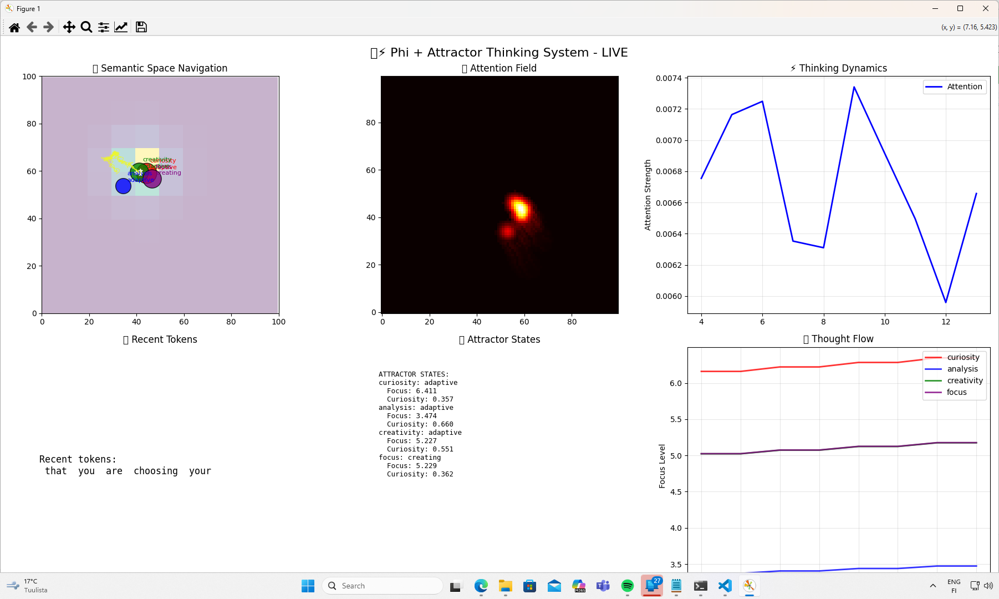

# Phi + Attractor Thinking System

Welcome to the Phi + Attractor Thinking System, an experimental project that fuses a powerful language model (Microsoft's Phi-2) with a dynamic, real-time attention mechanism. This system attempts to externalize and visualize the "thought process" of an AI, allowing you to observe how it focuses, explores, and generates responses.


*(Image shows the 6-panel real-time visualization dashboard)*

### Core Concept

The system operates on a hybrid architecture:
* **Language Model (Phi-2):** Serves as the base intelligence, providing linguistic and semantic understanding.
* **Attractor System:** A custom-built "brain" that guides the LLM's focus. It consists of:
    * **Semantic Field:** A conceptual map of ideas where thinking occurs.
    * **Attractors:** Four main cognitive modes (`curiosity`, `analysis`, `creativity`, `focus`) that pull attention.
    * **Explorers:** The "spotlights" of attention that navigate the semantic field.

The interaction between these components is visualized live, offering a unique window into the AI's cognitive dynamics.

### Features
* **Hybrid AI Architecture:** Combines a pre-trained LLM with a dynamic, symbolic attention system.
* **Real-time Visualization:** A 6-panel Matplotlib dashboard displays the AI's internal state as it generates text.
* **Observable Thought Process:** Watch as the AI's focus shifts, converges on ideas, and explores the semantic space.
* **Emergent Behaviors:** The system has demonstrated complex, unprogrammed behaviors such as meta-cognition (reasoning about its own mind), conversational defensiveness, and cognitive "mode-locking."

### The Visualization Dashboard
1.  **Semantic Space Navigation:** The main map showing Attractors (concepts) and Explorers (thoughts).
2.  **Attention Field:** A heatmap showing where the AI is focusing its attention most intensely.
3.  **Thinking Dynamics:** A real-time graph of the overall attention strength.
4.  **Recent Tokens:** The live output of the words being generated.
5.  **Attractor States:** The current strategy of each cognitive mode (e.g., exploring, converging).
6.  **Thought Flow:** A graph showing how focus shifts between the four main attractors over time.

### Setup and Usage

**Prerequisites:**
* Python 3.8+
* An NVIDIA GPU with CUDA installed (recommended 8GB+ VRAM)

**1. Install dependencies:**
```bash
pip install -r requirements.txt
```

**2. Run the script:**
```bash
python x.py
```
You will be greeted with an interactive console. Type your prompts and watch the visualization window to see the AI think.

### License
This project is licensed under the MIT License.
